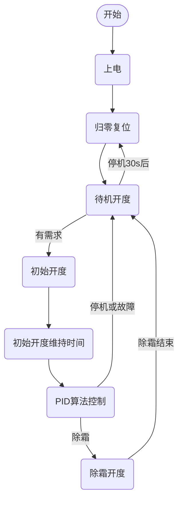

<!-- 注意事项 -->
<!-- 起始分级标题：##（二级标题） -->

## 主路电膨逻辑

- 主路电膨控制的流程为：

  
### 基本逻辑

根据初始开度和过热度目标值进行控制，并加上一定的阀开大/关小限制条件。

- 压机不运行时电子膨胀阀开到【**待机开度**】
- 有开机需求时开到初始开度，压机开启【**初开维持时间**】后进入吸气过热度pid调节

### 复位处理

1. **上电复位**
    控制器上电时，电子膨胀阀以【**主阀总步数**】× 1.2执行关阀动作，然后开到【**待机开度**】
2. **压机停机**
    压机停机时，电子膨胀阀由当前开度开到【**待机开度**】
3. **压机待机时的复位**
    压机停机30秒后，电子膨胀阀以“当前开度” × 1.2执行关阀动作直至0，然后重新开到【**待机开度**】。

### 制冷主路电膨控制

#### 制冷初始开度

制冷初始开度由 **环境温度`TA`** 和 **板换回水温度`TWin1`** 来计算：**板换回水温度`TWin1`** 越高、**环境温度`TA`** 越低，制冷初始开度就越大；否则初始开度越小。

- 制冷初始步数的计算方法如下：
  - 如果**环境温度`TA`** 或**板换回水温度`TWin1`** 故障时，制冷初始步数 ＝ 【制冷初开放大】 × 70 ×【主阀总步数】/ 100
  - 若【**制冷初开趋势环**】为0或 **环境温度`TA`** ≤【**制冷初开趋势环**】时，制冷初始步数 ＝ 【**制冷初开放大**】 × (100 － 1.0 × **环境温度`TA`** ＋ 0.6 × **板换回水温度`TWin1`**) ×【**主阀总步数**】/ 100
  - 其它不满足上述条件的情况，制冷初始步数 ＝【**制冷初开放大**】× (35 + 1.0 × **环境温度`TA`** ＋ 0.6 × **板换回水温度`TWin1`**) ×【**主阀总步数**】/ 100.
- 计算出的制冷初始步数限制范围：【**制冷初开下限**】～【**制冷初开上限**】×【**主阀总步数**】/ 100
- 辅助设置表格：详见《**主路电膨制冷初始开度.xlsx**》
  

#### 制冷最小开度

- “制冷排气过热度” 计算：
  - 【**辅阀使用设置**】设为 “压力排气过热度”，且 **冷凝饱和温度`TCS`** 可用时：
    - “制冷排气过热度” = **排气温度`TD`** - **冷凝饱和温度`TCS`**
  - 其他情况：
    - “制冷排气过热度” ＝ **排气温度`TD`** - **翅片温度`TF`**
- “**制冷最小开度**” 根据 “制冷排气过热度” 分段获取，如下所示：
  
  - 其中
    - **CDSH**：“制冷排气过热度”
    - **S1**：“**制冷最小开度**” ＝【**制冷最小开度1**】
    - **S2**：“**制冷最小开度**” ＝【**制冷最小开度2**】
    - **S3**：“**制冷最小开度**” ＝【**制冷最小开度3**】
    - **S4**：“**制冷最小开度**” ＝【**制冷最小开度3**】
    - **S5**：“**制冷最小开度**” ＝【**制冷最小开度4**】
- “制冷最小步数” ＝ “**制冷最小开度**” ×【**主阀总步数**】/ 100

#### 制冷吸气过热度控制

当【**主阀使用设置**】设为 “吸气过热度” 时，主阀根据吸气过热度目标值与吸气过热度当前值使用pid进行调节。

- 吸气过热度当前值 = **吸气温度`TS`** － **蒸发饱和温度`TES`**（通过 **低压压力`PRSs`** 转换）
- 如果蒸发饱和温度不可用：
  吸气过热度当前值 = **吸气温度`TS`** － **阀后温度`TV`**
  吸气过热度当前值 = **吸气温度`TS`** － **冷媒液侧温度`TRFliq`**( **阀后温度`TV`**不可用，**冷媒液侧温度`TRFliq`**可用：)
- 吸气过热度当前值 = **吸气温度`TS`** － **蒸发饱和温度`TES`**（通过 **低压压力`PRSs`** 转换）
- 吸气过热度目标值，根据 **环境温度`TA`** 和 **板换回水温度`TWin1`** 选择：
  - **环境温度`TA`** ＞【**制冷过热转换环**】时，制冷吸气过热度根据 **板换回水温度`TWin1`** 分段使用：
    - **板换回水温度`TWin1`** ＞【**制冷过热转换1**】：【**制冷吸气过热1**】
    - 【**制冷过热转换1**】＞ **板换回水温度`TWin1`** ＞【**制冷过热转换2**】：【**制冷吸气过热2**】
    - 【**制冷过热转换2**】＞**板换回水温度`TWin1`**：【**制冷吸气过热3**】
  - **环境温度`TA`** ＜【**制冷过热转换环**】-0.5℃时，制冷吸气过热度根据 **板换回水温度`TWin1`** 分段使用：
    - **板换回水温度`TWin1`** ＞【**制冷过热转换1**】：【**低环制冷过热1**】
    - 【**制冷过热转换1**】＞ **板换回水温度`TWin1`** ＞【**制冷过热转换2**】：【**低环制冷过热2**】
    - 【**制冷过热转换2**】＞ **板换回水温度`TWin1`**：【**低环制冷过热3**】

- 吸气过热度目标值根据以下条件进行补偿调整：
  - **排气温度`TD`** =  排温与压顶温度取高者
    - 当 **排气温度`TD`** ＞ 95℃时，过热度补偿【**主阀过热排温补**】× 2
    - 当 **排气温度`TD`** ＞ 75℃时，过热度补偿【**主阀过热排温补**】
  - 压机转速
    - 当 压机转速 ＜ 40rps时，过热度补偿【**主阀过热频率补**】× 2
    - 当 压机转速 ＜ 50rps时，过热度补偿【**主阀过热频率补**】

#### 制冷辅助调节

1. 强制开大：每个动作周期开大步数为：当前步数 ×【**主强动作比例**】

   - **排气温度`TD`**：【**高排温主辅次序**】为“辅阀优先”，且辅阀已到达不可调节（禁用、已开到最大、手动等）状态时才有效；或【**高排温主辅次序**】不为“辅阀优先”。
     - 当 **排气温度`TD`** ＞【**强制降频排温**】-5℃且为上升趋势时，进入强制开大
     - 当 **排气温度`TD`** ＜【**强制降频排温**】-10℃时，退出强制开大

2. 关小限制：膨胀阀只允许开大不允许关小

   - **排气温度`TD`** 较高时关小限制：仅辅阀步数为0时有效
     - 当 **排气温度`TD`** ＞【**强制降频排温**】-8℃ 时，进入关小限制
     - 当 **排气温度`TD`** ＜【**强制降频排温**】-13℃ 时，退出关小限制
     即提前于“强制开大”3℃排温进入“关小限制”
   - **低压压力`PRSs`**
     - “**制冷进关小限制低压压力**” ＝【**制冷低压过低**】+【**低压限加偏差**】
     - “**制冷退关小限制低压压力**” ＝ “**制冷进关小限制低压压力**” +【**低压辅调回差**】
     - 当 **低压压力`PRSs`** ≤ “**制冷进关小限制低压压力**” 时，进入关小限制
     - 当 **低压压力`PRSs`** ＞ “**制冷退关小限制低压压力**” 时，退出关小限制
   - **高压压力`PRSd`**
     - “**制冷进关小限制高压压力**” ＝【**制冷高压过高**】+【**高压限加偏差**】
     - “**制冷退关小限制高压压力**” ＝ “**制冷进关小限制高压压力**” +【**高压辅调回差**】
     - 当 **高压压力`PRSs`** ≥ “**制冷进关小限制高压压力**” 时，进入关小限制
     - 当 **高压压力`PRSs`** ＜ “**制冷退关小限制高压压力**” 时，退出关小限制

3. 强制关小：每个动作周期关小步数为：当前步数 ×【**主强动作比例**】
压机运行400秒后才开始判断

   - **蒸发温度`TE`**：【**压力传感器配置**】设为 “高低压独立” 且 **高压压力`PRSd`** ＜ “**制冷退关小限制高压压力**” 时才有
     - 当 **蒸发温度`TE`** ＞【**强关小蒸发上限**】时，进入强制关小；
     - 当 **蒸发温度`TE`** ＜【**强关小蒸发上限**】-1℃时，退出强制关小；

4. 开大限制：膨胀阀只允许关小不允许开大

   - **蒸发温度`TE`**
     - 当 **蒸发温度`TE`** ＞【**强关小蒸发上限**】-2℃时，进入开大限制
     - 当 **蒸发温度`TE`** ＜【**强关小蒸发上限**】-4℃时，退出开大限制

注：若同时存在强制开大和强制关小的情况，主阀默认强制开大。

### 制热主路电膨控制

#### 制热初始开度

制热初始开度由 **环境温度`TA`** 和 **板换回水温度`TWin1`** 来计算：**板换回水温度`TWin1`** 越高、**环境温度`TA`** 越低，制热初始开度就越小；否则初始开度越大。

- 如果**环境温度`TA`** 或**板换回水温度`TWin1`** 故障时，制热初始步数 ＝ 【**制热初开放大**】 × 50 ×【**主阀总步数**】/ 100
- 制热初始步数 ＝ “制热初开放大” × (75 － 1.0 × **板换回水温度`TWin1`** ＋ 0.6 × **环境温度`TA`**) ×【**主阀总步数**】/ 100。其中 “制热初开放大” 根据 **板换回水温度`TWin1`** 分了3段：【**制热初开放大1**】【**制热初开放大2**】【**制热初开放大3**】，分段点为【**制热初开转换1**】、【**制热初开转换2**】
- 计算出的制热初始步数限制范围：【**制热初开下限**】～【**制热初开上限**】×【**主阀总步数**】/ 100
- 辅助设置表格：详见《**主路电膨制热初始开度.xlsx**》
  
- 注：
  1. 除霜后初始开度：若【**除霜初开补偿**】不为0，则除霜后初始开度=进除霜前的步数 +【**除霜初开补偿**】
  2. 低环温高水温初始调节：
     - 生效条件
       1. 主阀、辅阀不为禁用，辅阀不为主路小阀
       2. 【**低环高温回温**】不为0且 **环境温度`TA`** ＜【**低环高温环温**】；
       3. **板换回水温度`TWin1`** ＞【**低环高温回温**】；
     - 控制逻辑
      低环温高水温工况下启动压机或退除霜转制热时，主阀先以【**低环高温主阀**】步开启，辅阀保持关闭，1分钟后辅阀以初始步数开启，90s后主阀转为初始开度，且初始开度维持时间使用特定值30秒，之后进入正常控制逻辑。

#### 制热最小开度

- “制热排气过热度” 计算：
  - 【**辅阀使用设置**】设为 “压力排气过热度”，且 **冷凝饱和温度`TCS`** 可用时：
    - “制热排气过热度” = **排气温度`TD`** - **冷凝饱和温度`TCS`**
  - 其他情况：
    - “制热排气过热度” ＝ **排气温度`TD`** - **板换出水温度`TWout1`**
- “**制热最小开度**” 根据 “制热排气过热度” 分段获取，如下所示：
  
  - 其中
    - **HDSH**：“制热排气过热度”
    - **S1**：“**制热最小开度**” ＝【**制热最小开度1**】
    - **S2**：“**制热最小开度**” ＝【**制热最小开度2**】
    - **S3**：“**制热最小开度**” ＝【**制热最小开度3**】
    - **S4**：“**制热最小开度**” ＝【**制热最小开度3**】
    - **S5**：“**制热最小开度**” ＝【**制热最小开度4**】
- “制热最小步数” ＝ “**制热最小开度**” ×【**主阀总步数**】/ 100

#### 制热吸气过热度控制

当【**主阀使用设置**】为 “吸气过热度” 时，主阀根据吸气过热度目标值与吸气过热度当前值使用pid进行调节。

- 吸气过热度当前值：
  - 【**压力传感器配置**】设为 “高低压复用” 时：**吸气温度`TS`** － **翅片温度`TF`**
  - 【**压力传感器配置**】设为 “仅低压” 时：**吸气温度`TS`** － **蒸发饱和温度`TES`**（通过 **低压压力`PRSs`** 转换）
- 吸气过热度目标值：
  根据 **环境温度`TA`** 分段获取，如下所示：
  
  - **S1** ～ **S9**：【**制热吸气过热1**】～【**制热吸气过热9**】

- 选择目标过热度后，再根据以下条件进行补偿调整：
  - **排气温度`TD`**
    - 当 **排气温度`TD`** ＞95℃时，过热度补偿【**主阀过热排温补**】× 2
    - 当 **排气温度`TD`** ＞75℃时，过热度补偿【**主阀过热排温补**】
  - 压机转速
    - 当 压机转速 ＜ 40rps时，过热度补偿【**主阀过热频率补**】× 2
    - 当 压机转速 ＜ 50rps时，过热度补偿【**主阀过热频率补**】

#### 制热辅助调节

1. 强制开大：每个动作周期开大步数为：当前步数 ×【**主强动作比例**】
  
   - **排气温度`TD`**：【**高排温主辅次序**】为“辅阀优先”，且辅阀已到达不可调节（禁用、已开到最大、手动等）状态时才有效；或【**高排温主辅次序**】不为“辅阀优先”。
     - 当 **排气温度`TD`** ＞【**强制降频排温**】-5℃且为上升趋势时，进入强制开大
     - 当 **排气温度`TD`** ＜【**强制降频排温**】-10℃时，退出强制开大

2. 关小限制：膨胀阀只允许开大不允许关小

   - **排气温度`TD`** 较高时关小限制：仅辅阀步数为0时有效
     - 当 **排气温度`TD`** ＞【**强制降频排温**】-8℃ 时，进入关小限制
     - 当 **排气温度`TD`** ＜【**强制降频排温**】-13℃ 时，退出关小限制
     即提前于“强制开大”3℃排温进入“关小限制”
   - **低压压力`PRSs`**
     - “**制热进关小限制低压压力**” ＝【**制热低压过低**】+【**低压限加偏差**】
     - “**制热退关小限制低压压力**” ＝ “**制热进关小限制低压压力**” +【**低压辅调回差**】
     - 当 **低压压力`PRSs`** ≤ “**制热进关小限制低压压力**” 时，进入关小限制
     - 当 **低压压力`PRSs`** ＞ “**制热退关小限制低压压力**” 时，退出关小限制
   - **高压压力`PRSd`**
     - “**制热进关小限制高压压力**” ＝【**制热高压过高**】+【**高压限加偏差**】
     - “**制热退关小限制高压压力**” ＝ “**制热进关小限制高压压力**” +【**高压辅调回差**】
     - 当 **高压压力`PRSs`** ≥ “**制热进关小限制高压压力**” 时，进入关小限制
     - 当 **高压压力`PRSs`** ＜ “**制热退关小限制高压压力**” 时，退出关小限制
   - **翅片温度`TF`**
     - 当 **翅片温度`TF`** ≤【**制热限关翅温**】时，进入关小限制
     - 当 **翅片温度`TF`** ＞【**制热限关翅温**】+1℃时，退出关小限制

3. 强制关小：每个动作周期关小步数为：当前步数 ×【**主强动作比例**】，压机运行400秒后才开始判断
   - **翅片温度`TF`**：低压压传使用且 **低压压力`PRSs`** ＞ “**制热退关小限制低压压力**” 时才有
     - 当 **翅片温度`TF`** ＞【**强关小蒸发上限**】时，进入强制关小
     - 当 **翅片温度`TF`** ＜【**强关小蒸发上限**】-1℃时，退出强制关小

4. 开大限制：膨胀阀只允许关小不允许开大
   - **翅片温度`TF`**
     - 当 **翅片温度`TF`** ＞【**强关小蒸发上限**】-2℃时，进入开大限制
     - 当 **翅片温度`TF`** ＜【**强关小蒸发上限**】-4℃时，退出开大限制

#### 除霜运行

除霜期间，电子膨胀阀的开度为【**除霜开度**】。

#### 变频补偿

初始开度结束以后，当压机转速每分钟变化超过【**主阀变频增量**】时，主阀步数在当前基础上补偿△ST.

- △ST  = 当前转速 × 转速增量 × 当前步数 × 变频调阀系数 / 10000
- 其中，变频调阀系数为：【**主阀升频系数**】或【**主阀降频系数**】
