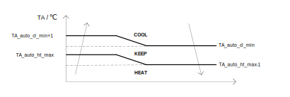

<!-- 注意事项 -->
<!-- 起始分级标题：##（二级标题） -->

## 可用模式

### 空调模式

- 当【**控制模式**】设为 “制冷模式” 时，“空调模式” 为制冷
- 当【**控制模式**】设为 “制热模式” 时，“空调模式” 为制热
- 当【**控制模式**】设为 “自动模式” 时，由 **环境温度`TA`** 决定 “空调模式” 为制冷或制热：
  
  - 其中
    - **TA_auto_cl_min**：【**自动制冷最低环**】
    - **TA_auto_ht_max**：【**自动制热最高环**】

### 热水模式

- 当【**热水功能**】设为 “禁用” 时，当前系统无热水模式
- 当【**热水功能**】设为 “使用” 时，当前系统有热水模式，此时线控器主界面显示 **热水水箱温度`THWt`**
